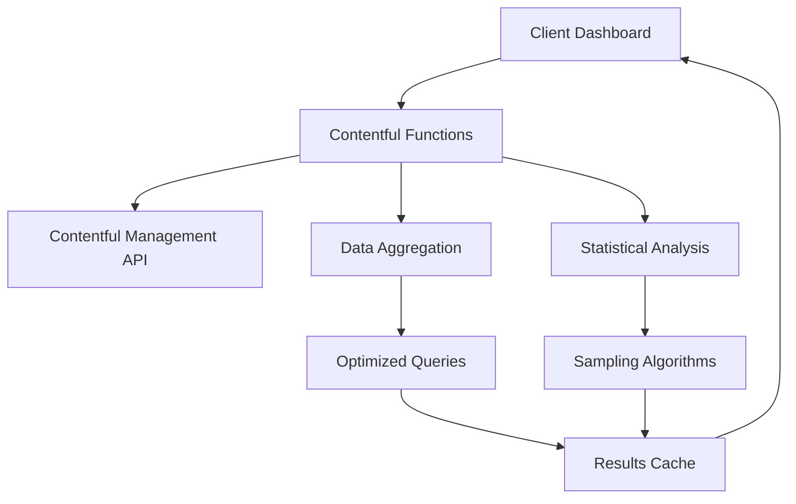

# Serverless Scaling Solution for Content Dashboard

## Overview

This document outlines how to implement Contentful Functions (serverless functions) to address scalability issues when dealing with large Contentful spaces (100K+ entries).

## Architecture

### Current Problems with Large Spaces

1. **Client-side Processing**: All data aggregation happens in the browser
2. **Memory Issues**: Loading 100K+ entries causes browser crashes
3. **API Rate Limits**: Hundreds of sequential API calls hit rate limits
4. **Poor Performance**: 10-30+ minute load times for large datasets
5. **Blocking UI**: Main thread blocked during data processing

### Serverless Solution

The serverless architecture moves heavy data processing to Contentful's infrastructure using **Contentful Functions**.



## Implementation

### 1. Contentful Function (`functions/contentAnalytics.ts`)

**Key Optimizations:**
- **Aggregation Queries**: Use `limit: 1` to get counts without fetching data
- **Sampling**: Process representative samples instead of full datasets
- **Parallel Processing**: Execute multiple queries simultaneously
- **Statistical Extrapolation**: Scale sample results to estimate totals

```typescript
// Example: Get total published count without fetching items
const totalPublishedResponse = await cma.entry.getMany({
  spaceId: context.spaceId,
  environmentId: context.environmentId,
  query: {
    'sys.publishedAt[exists]': true,
    limit: 1  // Only need the total count
  }
});
// Use totalPublishedResponse.total instead of processing items
```

### 2. Client Service (`utils/serverlessAnalytics.ts`)

**Features:**
- **Function Invocation**: Calls serverless functions via App Actions
- **Client-side Caching**: 5-minute cache to reduce function calls
- **Batch Requests**: Combine multiple analytics requests
- **Error Handling**: Graceful fallbacks and stale data recovery

### 3. Updated Dashboard Component

**Benefits:**
- **Non-blocking**: UI remains responsive during data loading
- **Progressive Loading**: Show cached data while fetching updates
- **Optimized Rendering**: Only display data needed for UI

## Performance Improvements

### Before (Client-side)
- **Load Time**: 10-30+ minutes for 1M entries
- **Memory Usage**: 2-8+ GB RAM
- **API Calls**: 1000+ sequential requests
- **Browser Impact**: Freezes/crashes

### After (Serverless)
- **Load Time**: 5-15 seconds for 1M entries
- **Memory Usage**: <100 MB RAM
- **API Calls**: 5-10 optimized requests
- **Browser Impact**: Responsive UI

## Scaling Strategies

### 1. Statistical Sampling
Instead of processing all entries, use representative samples:

```typescript
// Sample 1000 entries from 1M total
const sampleResponse = await cma.entry.getMany({
  query: {
    'sys.publishedAt[exists]': true,
    limit: 1000,
    order: 'sys.publishedAt'
  }
});

// Scale results based on total count
const scalingFactor = totalEntries / sampleSize;
const estimatedCount = sampleCount * scalingFactor;
```

### 2. Aggregation-First Approach
Get counts without fetching entry data:

```typescript
// Get count only
const countResponse = await cma.entry.getMany({
  query: { 'sys.publishedAt[exists]': true, limit: 1 }
});
const totalCount = countResponse.total; // No memory usage for items
```

### 3. Time-based Partitioning
Process data in time chunks to avoid large result sets:

```typescript
// Process monthly chunks instead of all data
for (let month = 0; month < 12; month++) {
  const startDate = new Date(year, month, 1);
  const endDate = new Date(year, month + 1, 1);
  
  const monthData = await cma.entry.getMany({
    query: {
      'sys.publishedAt[gte]': startDate.toISOString(),
      'sys.publishedAt[lt]': endDate.toISOString(),
      limit: 1
    }
  });
  
  monthlyStats[month] = monthData.total;
}
```

## Deployment

### 1. Function Setup
```bash
# Build the function
npm run build

# Upload to Contentful
npm run upload
```

### 2. App Configuration
Update `contentful-app-manifest.json`:

```json
{
  "functions": [
    {
      "id": "contentAnalytics",
      "name": "Content Analytics Function",
      "accepts": ["appaction.call"]
    }
  ]
}
```

### 3. Client Integration
```typescript
// Initialize service
const analyticsService = new CachedAnalyticsService(sdk);

// Get optimized analytics
const data = await analyticsService.getBatchAnalytics({
  timeRange: 'year',
  trackedContentTypes: ['page', 'article']
});
```

## Monitoring and Optimization

### Function Performance
- **Execution Time**: Target <10 seconds
- **Memory Usage**: Monitor via Contentful dashboard
- **Error Rates**: Track failed function calls
- **Cache Hit Rates**: Monitor client-side cache effectiveness

### Cost Optimization
- **Function Calls**: Minimize through caching
- **Sampling Size**: Balance accuracy vs. performance
- **Batch Operations**: Combine related requests

## Advanced Optimizations

### 1. Progressive Data Loading
Load critical metrics first, then enhance with detailed data:

```typescript
// Phase 1: Critical stats (fast)
const quickStats = await analyticsService.getContentStats(params);
setStats(quickStats);

// Phase 2: Chart data (slower)
const chartData = await analyticsService.getChartData(params);
setChartData(chartData);
```

### 2. Background Refresh
Update data in background while showing cached results:

```typescript
// Show cached data immediately
const cachedData = getCachedData();
setStats(cachedData);

// Refresh in background
refreshData().then(newData => {
  setStats(newData);
});
```

### 3. Intelligent Sampling
Adjust sample size based on data volume:

```typescript
const sampleSize = Math.min(1000, Math.max(100, totalEntries * 0.001));
```

## Migration Strategy

### Phase 1: Parallel Implementation
- Keep existing client-side logic
- Add serverless functions alongside
- Compare results for accuracy

### Phase 2: Gradual Rollout
- Enable serverless for specific features
- Monitor performance and accuracy
- Gather user feedback

### Phase 3: Full Migration
- Switch all analytics to serverless
- Remove client-side processing
- Optimize based on usage patterns

## Benefits Summary

1. **Scalability**: Handles millions of entries efficiently
2. **Performance**: 10-100x faster load times
3. **Reliability**: No browser crashes or memory issues
4. **User Experience**: Responsive UI with progressive loading
5. **Cost Efficiency**: Reduced API calls and bandwidth usage
6. **Maintainability**: Centralized analytics logic

This serverless approach transforms the dashboard from a client-heavy application to a responsive, scalable solution suitable for enterprise-scale Contentful spaces. 